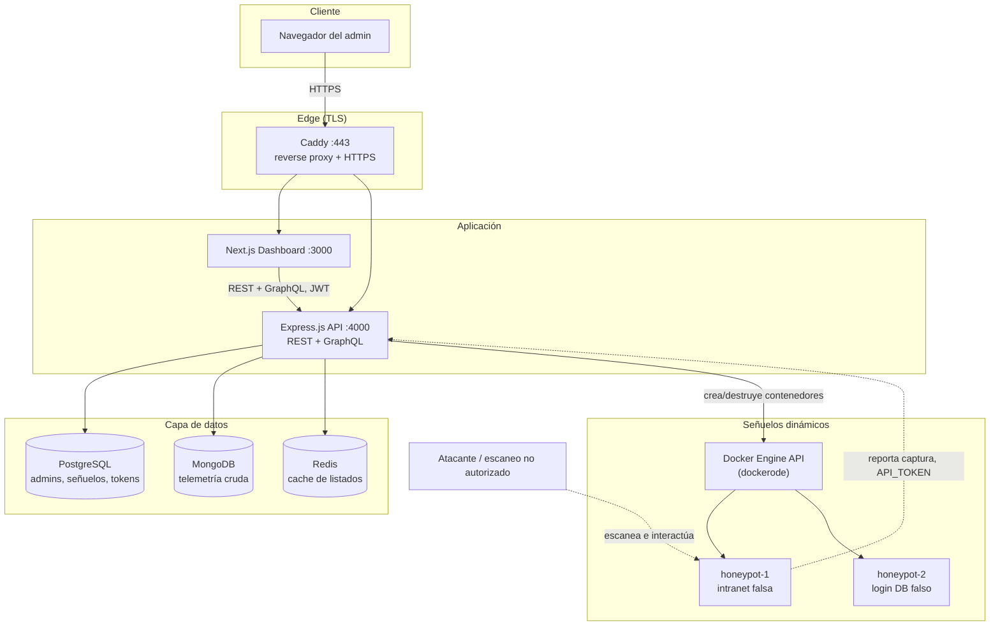
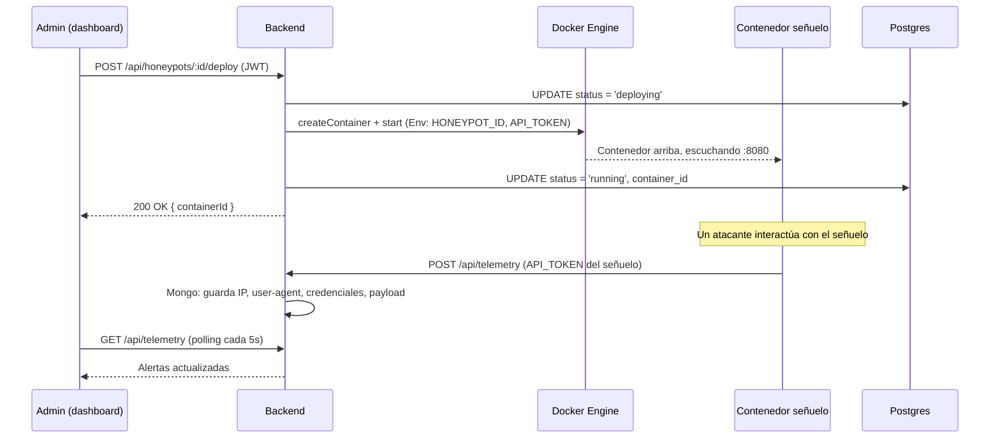

# Arquitectura

## Diagrama de componentes

Este diagrama está en Mermaid (diagrama-como-código). Para el entregable
visual de la rúbrica (Figma/Miro), pegá este bloque en https://mermaid.live,
exportá como PNG/SVG, e importalo como imagen en tu wireframe de Figma o Miro
— es el mismo diagrama, solo versionado en texto para que viva en el repo.

## Flujo de despliegue de un señuelo

## Por qué Docker Engine API y no Kubernetes para orquestar señuelos

El código de producción usa `dockerode` (API de Docker) para crear y destruir
los contenedores señuelo, no la API de Kubernetes. Es una decisión
consciente, no una carencia:

- El despliegue corre en **una sola VM** (ver `DEPLOY.md`). Un cluster K8s
  completo para orquestar contenedores de vida corta en un solo nodo es
  sobre-ingeniería: agrega un control plane, etcd, kubelet, y complejidad
  operativa sin ningún beneficio real a esta escala.
- `docker-entrypoint` + Docker Engine API ya da todo lo que se necesita:
  creación bajo demanda, red aislada por contenedor, límites de recursos,
  y destrucción limpia al detener el señuelo.
- Si el producto creciera a **multi-nodo** (ej: un señuelo por sucursal en
  varias regiones), ahí sí Kubernetes se justifica — por eso el repo incluye
  `k8s/honeypot-pod-template.yaml` como el diseño de esa migración: el mismo
  patrón (`Env: HONEYPOT_ID, API_TOKEN, BACKEND_URL`) traducido a un `Pod`
  spec, listo para cuando haga falta escalar horizontalmente con
  `@kubernetes/client-node` en lugar de `dockerode`.

## Stack completo

| Capa | Tecnología |
|---|---|
| Frontend | Next.js 14, TailwindCSS |
| Backend | Express.js, REST + GraphQL |
| Auth | JWT + OAuth2 (Google) + RBAC (superadmin/operator) |
| Bases de datos | PostgreSQL (control) + MongoDB (telemetría) |
| Cache | Redis (cache-aside, TTL 45s) |
| Orquestación de señuelos | Docker Engine API (dockerode) |
| TLS | Caddy (self-signed en local, Let's Encrypt automático en el VPS) |
| CI/CD | GitHub Actions (test + build + E2E + deploy por SSH) |
| Testing | Jest (unitario backend) + Cypress (E2E frontend) |
